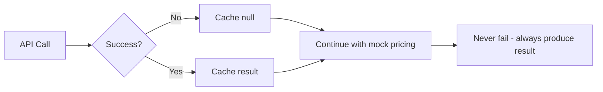

# Inventory Analyzer Logic Flow

```mermaid
flowchart TD
    A[Start: main()] --> B[Initialize InventoryAnalyzer]
    B --> C[Load inventory_data.csv]
    C --> D[Clean supplier prices]
    D --> E[Initialize output columns]

    E --> F[For each inventory item]
    F --> G{UPC available?}

    G -->|Yes| H[lookup_upc_product_info()]
    G -->|No| I[Skip UPC lookup]

    H --> J[Call UPCitemdb API]
    J --> K{API Success?}
    K -->|Yes| L[Cache UPC data]
    K -->|No| M[Cache null result]

    L --> N[get_mock_retail_price()]
    M --> N
    I --> N

    N --> O{Product category match?}
    O -->|Yes| P[Return category price]
    O -->|No| Q[Extract price from description]
    Q --> R[Calculate 4x supplier price]

    P --> S[calculate_discount_percentage()]
    R --> S

    S --> T[discount = (retail - supplier) / retail * 100]
    T --> U[categorize_price()]

    U --> V{discount >= 75%?}
    V -->|Yes| W[Good Price]
    V -->|No| X{discount >= 60%?}
    X -->|Yes| Y[Okay Price]
    X -->|No| Z[Bad Price]

    W --> AA[Update DataFrame row]
    Y --> AA
    Z --> AA

    AA --> BB{More items?}
    BB -->|Yes| F
    BB -->|No| CC[generate_report()]

    CC --> DD[Calculate category statistics]
    DD --> EE[Show top 10 best deals]
    EE --> FF[Show worst deals]
    FF --> GG[Save results to CSV]
    GG --> HH[End]

    subgraph "Price Categories"
        II[Good Price: >75% off]
        JJ[Okay Price: 60-75% off]
        KK[Bad Price: <60% off]
    end

    subgraph "Mock Pricing Logic"
        LL[Product Name Analysis]
        MM[Brand Detection]
        NN[Category-Based Pricing]
        OO[Fallback to 4x Supplier]
    end
```

## Key Data Flow Points

### 1. **Input Processing**
- CSV → DataFrame → Clean prices → Normalize UPCs

### 2. **Product Matching Pipeline**
```
UPC → API Lookup → Product Info
  ↓
Description → Category Detection → Mock Price
```

### 3. **Business Logic Engine**
```
Supplier Price + Retail Price → Discount % → Category
```

### 4. **Output Generation**
```
Enhanced DataFrame → Report Statistics → CSV Export
```

## Critical Decision Points

1. **UPC Availability**: Determines primary vs fallback matching
2. **API Success**: Graceful degradation to mock pricing
3. **Category Recognition**: Realistic vs generic pricing
4. **Discount Thresholds**: Business rule application (75%, 60%)

## Error Handling Flow



## Performance Optimizations

- **Caching**: Prevents duplicate API calls
- **Rate Limiting**: 0.1s delays prevent API abuse
- **Batch Processing**: Single pass through data
- **Memory Efficient**: Process row-by-row vs loading everything